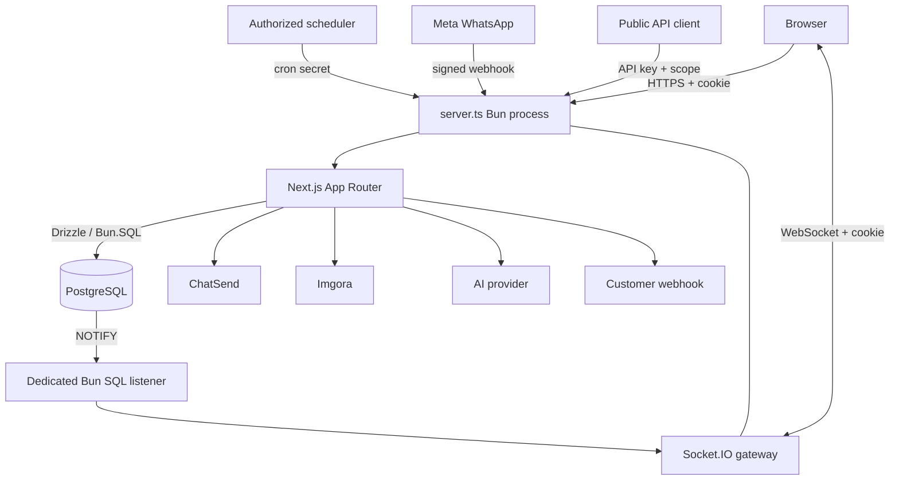
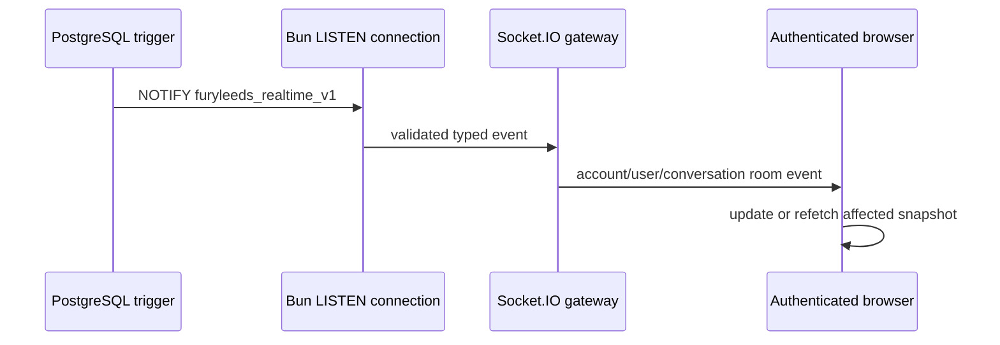

# FuryLeeds — System reference

> This is the root technical map. It explains how the full system fits together and links to the detailed architecture and module contracts. Read it after `AGENTS.md` and `ROLE.md`.

## 1. System identity

FuryLeeds is a multi-tenant team CRM centered on WhatsApp Cloud API. A tenant is an `account`. A human user has one profile linked to an account and an account role. The SaaS operator may additionally have the system role `superadmin`, but tenant resources still require an account context.

Main product capabilities:

- human authentication and account bootstrap;
- Google OAuth and email/password registration/login;
- members, invitations, roles, ownership transfer, sessions, and API keys;
- contacts, tags, notes, custom fields, identity normalization, and CSV import;
- shared inbox, messages, replies, reactions, media, assignment, quick replies, and status;
- Meta WhatsApp setup, registration, templates, webhooks, and delivery states;
- broadcasts with audience selection, personalization, delivery tracking, and resume;
- sales pipelines, stages, deals, ownership, and currency;
- trigger/action automations with waits and logs;
- interactive conversation flows with runs and timeouts;
- AI configuration, drafting, knowledge retrieval, auto-replies, handoff, and usage;
- notifications, browser notifications, and member presence;
- Imgora-backed files and media;
- scoped public REST API and signed outbound webhooks;
- Socket.IO realtime driven by PostgreSQL notifications.

## 2. Technology baseline

| Concern | Decision |
|---|---|
| Runtime/package manager/test runner | Bun 1.4+ |
| Framework | Next.js 16 App Router |
| UI | React 19, Tailwind CSS v4, Base UI primitives |
| Language | TypeScript 7 strict mode |
| Database | PostgreSQL on the user's VPS |
| SQL driver | Bun native `Bun.SQL` |
| ORM/migrations | Drizzle ORM and Drizzle Kit |
| Human authentication | Better Auth |
| OAuth | Google |
| Transactional auth email | ChatSend |
| Persistent files | Imgora |
| WhatsApp | Meta WhatsApp Cloud API |
| Realtime | Socket.IO, WebSocket-only |
| Formatting/linting | Biome |
| Tests | Bun test |

Versions are recorded in `package.json` and `bun.lock`; those files override prose if dependencies are updated.

## 3. Runtime topology



`server.ts` is mandatory in every environment because it owns both Next.js and Socket.IO. `next start` alone is not a valid production entry point.

Detailed topology: [`docs/arquitecture/architecture.md`](./docs/arquitecture/architecture.md).

## 4. Source structure and boundaries

- `src/app/`: App Router layouts, pages, and HTTP route handlers.
- `src/components/`: feature components and reusable UI primitives.
- `src/hooks/`: browser hooks for auth, capabilities, theme, media, notifications, presence, and realtime.
- `src/lib/auth/`: Better Auth configuration, sessions, account context, roles, invitations, and API-key auth.
- `src/lib/db/`: Drizzle schemas/relations and the lazy Bun.SQL runtime.
- `src/lib/api/v1/`: public API domain services and response contracts.
- `src/lib/whatsapp/`: Meta adapters, templates, sends, media, broadcasts, and webhook helpers.
- `src/lib/realtime/`: event contracts, client singleton, server gateway, and summary state.
- `src/lib/automations/`, `src/lib/flows/`, `src/lib/ai/`: domain engines.
- `src/lib/storage/`: Imgora and upload policy.
- `src/lib/webhooks/`: outbound webhook signing, SSRF protection, and delivery.
- `drizzle/`: ordered migration SQL and snapshots.
- `test/`: executable contracts and regression tests.

The full module ownership map is in [`docs/modules/_index.md`](./docs/modules/_index.md).

## 5. Identity, tenancy, and roles

### Human authentication

Better Auth owns:

- email/password signup and login;
- email verification;
- password reset through a six-digit email OTP;
- Google OAuth;
- cookie sessions;
- linked identity records.

ChatSend is invoked only by server-side Better Auth mail callbacks for verification, password-reset OTP, welcome, and password-change confirmation messages. The browser never receives ChatSend credentials or plaintext server-stored OTP data.

### Tenant model

- `accounts` is the tenant root.
- `profiles.account_id` associates a human with the active tenant.
- Tenant resources carry `account_id` directly or inherit it through a parent relation.
- Browser-supplied `accountId` is never authorization proof.
- Tenant isolation is currently enforced in application queries. PostgreSQL RLS is not implemented in this repository.

### Roles

Tenant hierarchy:

```text
owner > admin > agent > viewer
```

- `viewer`: read-only product access.
- `agent`: operational writes such as messages, contacts, deals, broadcasts, flows, and automations.
- `admin`: account-wide settings, integrations, templates, custom fields, members, invitations, and API keys.
- `owner`: ownership transfer and destructive account authority.
- `superadmin`: system-level SaaS role stored on the Better Auth user; it can satisfy tenant role minimums only after account context is resolved.

Authorization details: [`docs/arquitecture/security.md`](./docs/arquitecture/security.md) and [`docs/modules/auth-and-accounts.md`](./docs/modules/auth-and-accounts.md).

## 6. Data model

The checked-in schema contains Better Auth tables plus CRM tables for accounts, profiles, invitations, configuration, contacts, conversations, messages, templates, reactions, broadcasts, pipelines/deals, automations, flows, notifications, presence, AI, API keys, and outbound webhooks.

Core invariants:

- UUID primary keys for CRM entities; text IDs for Better Auth identity tables.
- Account ownership is explicit.
- Foreign keys and unique constraints enforce parentage and idempotency where practical.
- Meta inbound messages use conflict-safe persistence.
- Secrets are encrypted or hashed according to their lifecycle.
- Schema changes require Drizzle migration SQL.

Authoritative inventory: [`docs/arquitecture/database.md`](./docs/arquitecture/database.md).

## 7. HTTP surfaces

There are four principal trust surfaces:

1. **Browser/session APIs** — Better Auth cookie plus server-side account role checks.
2. **Public `/api/v1` APIs** — account-bound API key plus scope checks.
3. **Provider callbacks** — Meta challenge/raw-body signature validation.
4. **Cron routes** — shared cron secret and bounded work.

The complete method/path inventory, payload conventions, statuses, auth requirements, pagination, and rate limits are documented in [`docs/arquitecture/api-contracts.md`](./docs/arquitecture/api-contracts.md).

## 8. WhatsApp lifecycle

### Configuration

An admin supplies Meta identifiers and credentials. The server validates numeric IDs, verifies the phone number, optionally verifies WABA ownership, registers the number when requested, subscribes the WABA, encrypts secrets, and stores the account configuration.

### Inbound

1. Meta sends a signed webhook.
2. The route reads the raw body and verifies `x-hub-signature-256`.
3. Tenant is resolved from the configured phone number.
4. Contact identity is normalized from phone or business-scoped user ID.
5. Contact/conversation/message are persisted idempotently.
6. Media may be mirrored to Imgora.
7. Flow, automation, AI, and outbound webhook effects run according to precedence.
8. PostgreSQL emits realtime change notifications.

### Outbound

Messages resolve the account's WhatsApp credentials, validate the destination and payload, call Meta, persist the local message, and expose delivery updates through webhook status callbacks and realtime.

Detailed contract: [`docs/modules/whatsapp.md`](./docs/modules/whatsapp.md).

## 9. Realtime model



Rules:

- Socket authentication uses Better Auth cookies.
- Rooms are account/user/conversation scoped.
- Transport is WebSocket-only.
- HTTP snapshots initialize and recover state; they are not periodic polling loops.
- Events are hints, not a durable event log.
- The in-memory Socket.IO adapter supports one process only.

See [`docs/arquitecture/realtime.md`](./docs/arquitecture/realtime.md).

## 10. Files and media

Imgora is the persistent object store for avatars, chat media, template media, and other allowed collections. FuryLeeds does not persist user files on the VPS filesystem.

The server:

- validates collection, MIME type, extension, and byte limits;
- builds account-isolated paths;
- uploads with server-side Imgora credentials;
- stores or returns the resulting remote reference;
- signs/proxies references when required;
- mirrors eligible inbound WhatsApp media best-effort.

See [`docs/modules/files-and-media.md`](./docs/modules/files-and-media.md).

## 11. Background and asynchronous work

Current mechanisms:

- Next.js `after()` for post-response provider work;
- cron-protected routes for delayed automation and flow cleanup;
- PostgreSQL `LISTEN/NOTIFY` for realtime hints;
- best-effort outbound customer webhooks.

None of these is a durable general-purpose queue. Work that must survive process termination needs an explicit persisted job/lease/retry design before being described as durable.

## 12. Frontend system

The browser application uses server layouts/pages where possible and client components for interactive CRM views. `AuthProvider` exposes account/session state and capability helpers. Feature pages consume JSON route handlers and Socket.IO events. UI permissions improve UX but always mirror server authorization.

The design system uses semantic CSS variables, Tailwind v4 utilities, Base UI-backed primitives, light/dark modes, and selectable accent themes.

See:

- [`docs/arquitecture/frontend.md`](./docs/arquitecture/frontend.md)
- [`docs/arquitecture/design-system.md`](./docs/arquitecture/design-system.md)
- [`docs/modules/pages.md`](./docs/modules/pages.md)
- [`docs/modules/components.md`](./docs/modules/components.md)
- [`docs/modules/hooks.md`](./docs/modules/hooks.md)

## 13. External systems

- **Meta WhatsApp Cloud API**: messaging, templates, media, registration, webhooks.
- **ChatSend**: authentication and account email through server-side token exchange.
- **Imgora**: persistent external file storage.
- **Google OAuth**: human identity through Better Auth.
- **OpenAI/Anthropic-compatible providers**: BYO-key AI generation/embedding paths.
- **Customer webhooks**: HTTPS-only, signed, SSRF-filtered outbound events.

Configuration and failure behavior: [`docs/arquitecture/integrations.md`](./docs/arquitecture/integrations.md).

## 14. Development and validation

Primary commands:

```bash
bun install
bun run dev
bun run check
bun run typecheck
bun run test
bun run build
bunx drizzle-kit check
bun run db:migrate
```

`bun run db:migrate` requires an authorized real PostgreSQL URL. Never use or document a live password in prose or command output.

Testing and Definition of Done:

- [`docs/process/testing-strategy.md`](./docs/process/testing-strategy.md)
- [`docs/process/definition-of-done.md`](./docs/process/definition-of-done.md)

## 15. Deployment reality

Verified facts:

- the accepted platform is Dokploy on a self-managed VPS;
- FuryLeeds is a Dokploy Application built from the root `Dockerfile` with context `.` and final stage `runner`;
- the container starts `server.ts` through `bun run start`, runs as non-root, listens on port `3000`, and exposes `/health`;
- PostgreSQL and persistent files live outside the application filesystem;
- Dokploy/Traefik terminates HTTPS and routes the canonical domain, including WebSocket upgrades for `/socket.io`;
- `compose.yml` is intentionally absent because Docker Compose is not the selected deployment method;
- PostgreSQL backup/restore, production smoke verification, CI image publishing, monitoring, and horizontal scaling remain operational work.

See [`docs/process/deployment.md`](./docs/process/deployment.md) and [`docs/TODO.md`](./docs/TODO.md).

## 16. Known constraints requiring deliberate decisions

- process-local rate limits;
- in-memory Socket.IO adapter;
- non-durable `after()` work;
- best-effort outbound webhook delivery;
- CSP report-only mode;
- AI vector schema/query compatibility not fully established;
- potential phone-normalization migration expression discrepancy;
- no finalized PostgreSQL backup/restore, CI image pipeline, or incident policy.

These must be solved through architecture work, migrations, tests, and docs—not hidden compatibility patches.

## 17. Documentation graph

Start at [`docs/README.md`](./docs/README.md). Every behavior change must update its owning document. The exhaustive HTTP inventory lives in `api-contracts.md`; exhaustive page/component/hook catalogs live under `docs/modules/`; process rules live under `docs/process/`; durable decisions live in `docs/arquitecture/decisions.md`; active state and next actions live in `MEMORY.md`.
