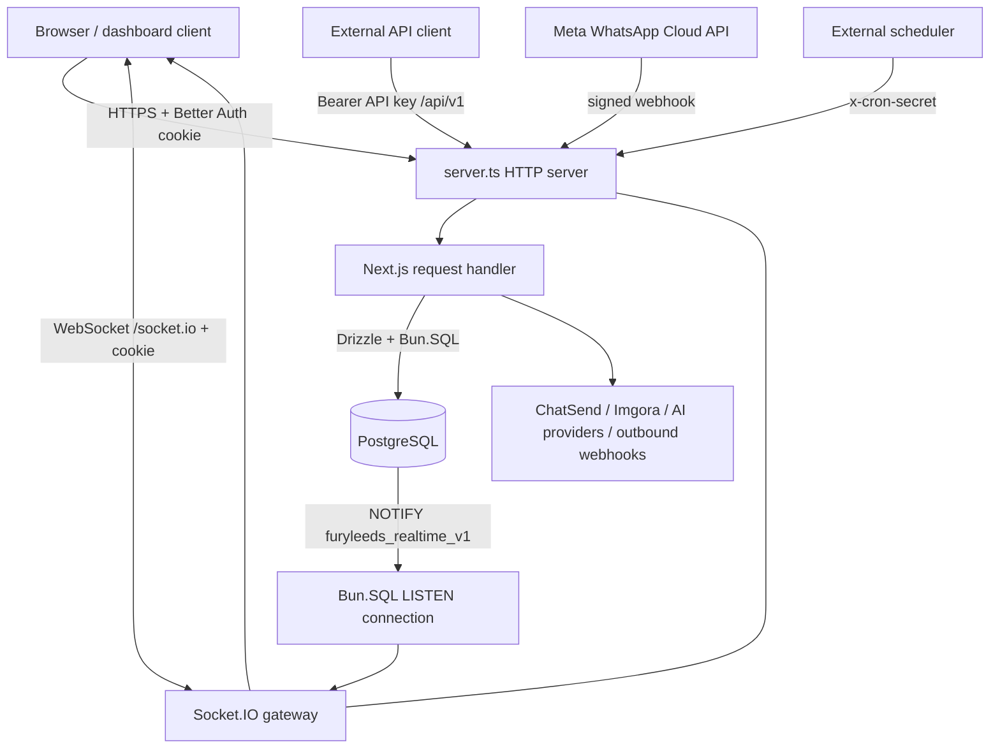

# FuryLeeds Architecture

> **Scope and source of truth.** This document describes the code in this repository as inspected on 2026-09-24. When prose and code disagree, `src/`, `server.ts`, `package.json`, `drizzle/`, and `scripts/` are authoritative.

## Documentation map

- [Database architecture](./database.md)
- [HTTP API contracts](./api-contracts.md)
- [Security model](./security.md)
- [Realtime architecture](./realtime.md)
- [External integrations](./integrations.md)

## System purpose

FuryLeeds is a multi-user, account-scoped WhatsApp CRM. It combines a shared inbox, contacts, tags and custom fields, pipelines and deals, broadcasts, message templates, automations, interactive flows, notifications/presence, AI-assisted replies and a scoped public API.

## Runtime and primary stack

| Layer | Actual implementation |
|---|---|
| JavaScript runtime/package manager | Bun (`packageManager: bun@1.4.0`, engine `>=1.4.0`) |
| Web application | Next.js 16 App Router, React 19, TypeScript |
| Process entry point | `server.ts`, run by `bun run server.ts` in development and production |
| HTTP and WebSocket transport | One Node-compatible HTTP server; Next handles HTTP and Socket.IO attaches to the same server at `/socket.io` |
| Database | PostgreSQL through `Bun.SQL`; Drizzle ORM uses `drizzle-orm/bun-sql` |
| Authentication | Better Auth with the Drizzle PostgreSQL adapter and cookie sessions |
| Realtime | Socket.IO over WebSocket only, fed by PostgreSQL `LISTEN/NOTIFY` |
| Styling/UI | Tailwind CSS 4 and React component libraries |
| Formatting/linting/tests | Biome, TypeScript, Bun test |

The application is **Bun-dependent**, not merely Bun-compatible. `src/lib/db/index.ts` checks for the global `Bun` object and throws if the application is run under a runtime that does not provide it.

## Process topology



`server.ts`:

1. derives `dev` from `NODE_ENV`, binds to `127.0.0.1` in development or `0.0.0.0` in production, and reads the port from `PORT` (default `3000`);
2. rejects invalid TCP ports;
3. prepares Next.js;
4. creates the shared HTTP server;
5. creates the realtime gateway before listening;
6. handles `SIGINT`/`SIGTERM` by closing Socket.IO/the PostgreSQL listener and then Next.js.

Because the Socket.IO gateway is part of the custom server, deployments must run `bun run server.ts`; a deployment mode that invokes only `next start` would omit realtime.

## Code organization

| Path | Responsibility |
|---|---|
| `server.ts` | Process bootstrap and graceful shutdown |
| `src/app/` | App Router pages, layouts and all route handlers |
| `src/app/api/` | Session API, internal dashboard API, public v1 API, Meta webhook and cron entry points |
| `src/components/` | UI components organized by feature |
| `src/hooks/` | Browser hooks, including authenticated realtime consumption |
| `src/lib/auth/` | Better Auth configuration, account context, invitations and role policy |
| `src/lib/db/` | Drizzle schemas, relations and Bun.SQL/Drizzle initialization |
| `src/lib/realtime/` | Socket event types, browser singleton, gateway and summary store |
| `src/lib/whatsapp/` | Meta API adapter, webhook helpers, sends, templates, broadcasts and media handling |
| `src/lib/automations/` | Triggered automation engine and delayed execution resume |
| `src/lib/flows/` | Interactive flow graph, execution and timeout policy |
| `src/lib/ai/` | BYO-key OpenAI/Anthropic generation and knowledge retrieval |
| `src/lib/storage/` | Imgora adapter, upload policy and signed asset references |
| `src/lib/webhooks/` | Public API webhook registration, signing, SSRF checks and delivery |
| `src/lib/api/v1/` | Stable public API domain services, pagination and response envelopes |
| `drizzle/` | Ordered SQL migrations and Drizzle metadata |
| `scripts/migrate.ts` | Migration runner using the same Bun.SQL Drizzle stack |
| `test/` | Bun test suite |

## Request and execution models

### Browser/dashboard requests

Protected pages are filtered in `src/proxy.ts`. The proxy loads the Better Auth session and redirects unauthenticated page requests to `/login`. Route handlers still perform their own authentication and authorization; the proxy is not the data authorization boundary.

A typical protected route calls one of:

- `getCurrentAccount()` for any authenticated account member;
- `requireRole('viewer' | 'agent' | 'admin' | 'owner')` for capability thresholds.

The returned account context carries `userId`, `accountId`, account role, system role, and the database handle. Queries are expected to include `accountId`; see [Security](./security.md#tenant-isolation).

### Public API requests

`/api/v1/*` accepts an API key in `Authorization: Bearer <key>` (a bare value is also parsed). The key resolves directly to one account and a list of scopes. Public routes use a versioned envelope and cursor pagination. Details are in [API contracts](./api-contracts.md#public-api-v1).

### Meta webhook processing

- `GET /api/whatsapp/webhook` performs Meta challenge verification against encrypted per-account verify tokens.
- `POST` reads the exact raw body, verifies `x-hub-signature-256`, parses JSON, immediately schedules processing with Next.js `after()`, and returns `200`.
- Processing resolves the tenant by globally unique `phone_number_id`, then creates/updates contacts, conversations, messages, reactions and delivery status. It may also dispatch flows, automations, AI auto-replies and outbound FuryLeeds webhooks.

See [Integrations](./integrations.md#meta-whatsapp-cloud-api).

### Background work

There is no general-purpose queue worker in this repository.

- Webhook work and public broadcast fan-out use Next.js `after()` and remain bounded by route execution lifetime (`maxDuration = 60` on those handlers).
- Delayed automation steps are persisted in `automation_pending_executions`; an external scheduler calls `GET /api/automations/cron`. Each call atomically claims up to 50 due rows with `FOR UPDATE SKIP LOCKED`.
- An external scheduler calls `GET /api/flows/cron` to mark stale active runs as timed out.
- Both cron routes require `x-cron-secret` matching `AUTOMATION_CRON_SECRET` in constant time.

These scheduled scans are operational jobs, not UI/realtime polling. Browser change delivery is event-driven through PostgreSQL notifications and Socket.IO.

## Database access

`src/lib/db/index.ts` lazily initializes one runtime state containing:

- a `Bun.SQL` pool (`max: 20`, idle timeout 30 seconds, connection timeout 5 seconds);
- a Drizzle `BunSQLDatabase` over the combined auth, CRM and relation schema.

In non-production, the state is cached on `globalThis` to survive Next development reloads. Raw tagged SQL and transactions use `sqlClient`; typed queries use `db`. Realtime owns a second dedicated `Bun.SQL` connection (`max: 1`, no idle timeout) solely for `LISTEN`.

See [Database](./database.md).

## Identity, account and role model

There are two role dimensions:

1. **System role** on Better Auth `user.system_role`: `user` or `superadmin`.
2. **Account role** on `profiles.account_role`: `owner > admin > agent > viewer`.

A successful signup creates a Better Auth user and, in an after-create database hook, transactionally creates an `accounts` row and an owner `profiles` row. `SUPERADMIN_EMAILS` only affects the system role assigned at user creation. `requireRole()` lets a `superadmin` bypass account-role minimums after a valid profile/account context has been loaded.

The current model gives each user exactly one profile (`profiles.user_id` is unique) and each account owner at most one owned account (`accounts.owner_user_id` is unique). Invitations move a new user's initially empty personal account profile into the inviting account; they do not create a second concurrent membership.

See [Security](./security.md#authorization-and-roles).

## Domain boundaries

### Messaging and inbox

Contacts belong to an account and have normalized phone/WhatsApp identities. An account has at most one conversation per contact. Messages support text, media, location, templates and interactive content, replies, delivery/error metadata, and agent/customer reactions. Conversation summary columns (`last_message_*`, unread count) support inbox listing.

### CRM

Account-scoped contacts can have tags, custom fields and notes. Pipelines contain stages; deals can reference contacts, conversations and assignees.

### Broadcasts and templates

Broadcasts use approved WhatsApp templates and persist one recipient row per contact. PostgreSQL triggers derive aggregate funnel counts from recipient status changes. Dashboard and public API broadcast dispatch are capped at 1,000 recipients per request; dashboard resume also caps one call at 1,000 and treats a delivery lock as stale after 30 minutes.

### Automations and flows

Automations are ordered/branched steps triggered by events, with logs and persisted delayed continuations. Flows are graph-shaped conversational interactions with nodes, active runs, run events and fallback/timeout behavior. The two are separate execution models and table families.

### AI

Each account may configure one OpenAI or Anthropic provider with a BYO key, prompt and auto-reply options. Knowledge documents are chunked, stored with PostgreSQL FTS, and optionally embedded through OpenAI. Usage is recorded by account/conversation. See the database caveat about the current embedding column in [Database](./database.md#known-schema-and-migration-limits).

### Files

Browser uploads pass through authenticated `/api/files`; provider credentials never reach the browser. Imgora objects are partitioned by account and collection. The client receives a CDN URL and an opaque HMAC-signed reference for authenticated resolve/delete operations.

## Configuration inventory

Names only—never put real values in documentation or source control.

| Variable | Purpose | Requirement observed in code |
|---|---|---|
| `DATABASE_URL` | PostgreSQL for Drizzle, raw SQL and realtime listener | Required at runtime and for migrations |
| `BETTER_AUTH_URL` | Canonical origin for auth, links and Socket.IO origin checks | Required in production; localhost fallback outside production |
| `BETTER_AUTH_SECRET` | Better Auth secret; fallback signer for Imgora references | Required for a secure deployment |
| `SUPERADMIN_EMAILS` | Comma-separated emails promoted on user creation | Optional |
| `GOOGLE_CLIENT_ID`, `GOOGLE_CLIENT_SECRET` | Enable Google sign-in only when both exist | Optional pair |
| `CHATSEND_BASE_URL`, `CHATSEND_API_KEY` | Verification, reset OTP, welcome, and password-change email | Required for those email flows |
| `ENCRYPTION_KEY` | AES-256-GCM key for WhatsApp tokens and outbound webhook secrets; preferred file-reference signer | Required by WhatsApp/webhook-secret encryption; expected as 64 hex characters by the implementation |
| `META_APP_ID` | WABA subscription diagnostics and template media upload | Required for those operations |
| `META_APP_SECRET` | One or more comma-separated Meta webhook HMAC secrets | Required for inbound POSTs; missing value fails closed |
| `WHATSAPP_TEMPLATES_DRY_RUN` | Skip live template mutation when `true` or `1` | Optional |
| `IMGORA_API_URL`, `IMGORA_API_KEY`, `IMGORA_ORIGIN`, `IMGORA_BASE_FOLDER` | Server-side Imgora storage | Required when file operations run |
| `AI_REQUEST_TIMEOUT_MS` | Provider timeout; default 30,000 ms | Optional |
| `AI_CONTEXT_MESSAGE_LIMIT` | Recent message count; default 20 | Optional |
| `AUTOMATION_CRON_SECRET` | Shared secret for both cron routes | Required to enable cron routes |
| `PORT`, `NODE_ENV` | Server port and mode | Optional except production mode is normally set by start script |

## Build, migration and validation commands

```text
bun install
bun run dev
bun run build
bun run start
bun run typecheck
bun run check
bun test
bun run db:generate
bun run db:migrate
bun run db:studio
```

`bun run db:migrate` runs `scripts/migrate.ts`, applies migrations from `./drizzle`, closes the SQL client and exits. Schema generation reads `src/lib/db/*-schema.ts` and targets PostgreSQL's `public` schema.

## Deployment and scaling limits

The accepted production target is a single-replica Dokploy Application using the root `Dockerfile`, context `.`, final stage `runner`, and container port `3000`. Dokploy/Traefik owns HTTPS/domain routing, while `/health` drives rollout health. Docker Compose is not an active deployment path. See [Deployment](../process/deployment.md).

- **Single-process rate limits:** fixed-window counters live in process memory. Multiple processes/regions multiply the effective allowance and do not share state.
- **Socket.IO adapter:** no Redis or other cross-instance adapter is configured. Account/user/conversation rooms are process-local. PostgreSQL notifications reach every listener, but a load balancer must keep the WebSocket connected to the process holding that socket.
- **WebSocket only:** long-polling fallback is explicitly disabled on server and client. Proxies must support WebSocket upgrades at `/socket.io`.
- **PostgreSQL notification size:** notification payloads must stay below PostgreSQL's ~8 KB limit. The message trigger truncates customer text and falls back to identifiers only if necessary.
- **Best-effort asynchronous work:** `after()` is not a durable queue. A 60-second bound can truncate very large broadcasts; the code explicitly recommends splitting near-cap public broadcasts.
- **Application-level tenancy:** no PostgreSQL Row Level Security is declared. Every query and mutation must retain its `account_id` predicate.
- **CSP is report-only:** the configured content policy reports but does not block violations.
- **One account membership per user and one WhatsApp config per account:** these are current schema/product constraints, not flexible organization membership.
- **Provider availability:** messaging, email, media and AI paths depend on third-party services and surface degraded or provider-specific failures.
