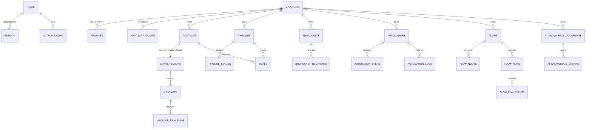

# Database Architecture

> This describes `src/lib/db/auth-schema.ts`, `src/lib/db/crm-schema.ts`, `src/lib/db/relations.ts`, the seven SQL migrations in `drizzle/`, and their runtime use.

Related: [Architecture](./architecture.md) · [Security](./security.md) · [Realtime](./realtime.md) · [API contracts](./api-contracts.md)

## Runtime and ORM

FuryLeeds uses PostgreSQL through Bun's native `Bun.SQL` client and Drizzle's `bun-sql` driver. `src/lib/db/index.ts` exposes:

- `db`: typed Drizzle queries and transactions;
- `sqlClient`: raw tagged SQL, explicit transactions, migrations and PostgreSQL `LISTEN`.

The main pool is lazy, process-singleton in every environment, and configured with `max: 10`, `idleTimeout: 30`, and `connectionTimeout: 5`. A separate one-connection client is held open by the realtime gateway. `DATABASE_URL` is mandatory. Graceful shutdown closes both the listener and the main pool; creating a pool per query would exhaust PostgreSQL connections and is prohibited.

Drizzle Kit uses PostgreSQL, schema glob `./src/lib/db/*-schema.ts`, output `./drizzle`, and `schemaFilter: ['public']`.

## Identity and tenancy model

The database has 40 declared tables: 4 Better Auth tables and 36 CRM tables.

`accounts.id` (UUID) is the tenant key. Most tenant-owned root tables carry a non-null `account_id` with `ON DELETE CASCADE`. Child tables often derive tenancy through their parent (for example, `messages` through `conversations`, `pipeline_stages` through `pipelines`, and `broadcast_recipients` through `broadcasts`).

There is **no PostgreSQL Row Level Security policy** in the checked-in schema or migrations. Tenant isolation is implemented in application queries by combining entity identifiers with `account_id`, or by joining through an account-scoped parent. This makes query review part of the security boundary.

The legacy/audit `user_id` columns on many CRM rows are not the tenant key. Shared-account visibility is controlled by `account_id`; `user_id` records a creator/config owner/sender of record where the schema requires one.

## High-level entity graph

## Table catalog

### Better Auth tables

| Table | Purpose and important constraints |
|---|---|
| `user` | Better Auth identity. Text UUID-like ID, unique email, verification flag, optional image, and `system_role` defaulting to `user`. |
| `session` | Cookie session backing store. Unique token, expiration, optional IP/user-agent, and cascading FK to `user`. |
| `account` | Better Auth provider/password identity, not the CRM tenant account. Stores provider IDs and optional provider/password token fields; cascading FK to `user`. |
| `verification` | Better Auth OAuth state, verification and reset values with identifier and expiry. Its text ID has a PostgreSQL `gen_random_uuid()::text` default required by adapter inserts that use `DEFAULT`. |

The naming collision is important: singular `account` is Better Auth identity data; plural `accounts` is the CRM tenant.

### Tenant and membership

| Table | Purpose and important constraints |
|---|---|
| `accounts` | Tenant root. Name, unique `owner_user_id`, timestamps and 3-uppercase-letter `default_currency` (default `USD`). The unique owner index means one owned account per user. |
| `profiles` | Exactly one CRM membership per Better Auth user (`user_id` unique), linked to one `accounts` row, with `owner/admin/agent/viewer` role, name/email/avatar. Account deletion cascades. |
| `account_invitations` | One-time invitation metadata. Stores only SHA-256 `token_hash`; role cannot be `owner`; unique hash, expiry, creator, acceptance timestamp/user. |
| `api_keys` | Tenant-bound public API credentials. Stores prefix and unique SHA-256 hash, scopes, expiration/revocation/last-use metadata; never stores plaintext. |

### WhatsApp and inbox

| Table | Purpose and important constraints |
|---|---|
| `whatsapp_config` | One configuration per account and one account per `phone_number_id`. Encrypted access/verify tokens, optional WABA ID, connected/registration/subscription state, registration error, and inbound-media mirror toggle. |
| `contacts` | Tenant contact identity and profile. Generated `phone_normalized`, optional BSUID/parent BSUID/username. Partial unique indexes enforce non-empty normalized phone and non-null WhatsApp user ID uniqueness per account. |
| `conversations` | One conversation per `(account_id, contact_id)`. Status `open/pending/closed`, assignee, summary/unread fields and AI takeover/count/summary fields. |
| `messages` | Conversation messages. Sender `customer/agent/bot`; type `text/image/document/audio/video/location/template/interactive`; delivery status `sending/sent/delivered/read/failed`; Meta ID, media/interactive/reply/AI/error metadata. `(conversation_id, message_id)` is unique. |
| `message_reactions` | Per target/actor reaction state. Unique `(actor_id, actor_type, message_id)` and actor type `customer/agent`. Cascades with message and conversation. |
| `quick_replies` | Account quick replies of `text` or `interactive` kind. |
| `notifications` | Per-user account notification. Current DB check permits only `conversation_assigned`; optional conversation/contact/actor and read timestamp. |
| `member_presence` | One row per user with account, `online/away`, and last-seen time. |

### Contact enrichment

| Table | Purpose and important constraints |
|---|---|
| `tags` | Account-owned tag with name/color and creator/audit user. |
| `contact_tags` | Many-to-many join; unique `(contact_id, tag_id)`, cascades from both parents. |
| `custom_fields` | Account field definition with free-text type and optional JSON options. |
| `contact_custom_values` | Contact/field value; unique `(contact_id, custom_field_id)`, cascades from both parents. |
| `contact_notes` | Account-scoped note linked to a contact and author user. |

### Pipelines

| Table | Purpose and important constraints |
|---|---|
| `pipelines` | Account-owned named pipeline. |
| `pipeline_stages` | Ordered/color stage under a pipeline; cascades with pipeline. |
| `deals` | Account deal linked to pipeline and stage, optionally contact, conversation and assignee profile. Numeric value `(12,2)`, ISO-like currency text, close date and `open/won/lost` status. Pipeline deletion cascades; several optional references become null. |

### Broadcasts and templates

| Table | Purpose and important constraints |
|---|---|
| `message_templates` | Account template mirror with Meta ID/status/quality/rejection/submission fields, header/body/footer/buttons/sample values. Categories are `Marketing/Utility/Authentication`; header types are text/image/video/document; buttons are capped at 10 by a JSON check. Template JSON writes use explicit PostgreSQL `::jsonb` binding because implicit Bun.SQL/Drizzle inference can double-encode arrays/objects as JSON strings. Unique `(user_id, name, language)`. |
| `broadcasts` | Account campaign using a template, language, variables/audience, schedule, delivery lock and aggregate counters. Status `draft/scheduled/sending/sent/failed`. |
| `broadcast_recipients` | Recipient state and Meta message ID, timestamps, template params/error. Status `pending/sent/delivered/read/replied/failed`; non-null Meta IDs are globally unique in this table. |

A trigger in migration `0002` recalculates broadcast counters when recipient status changes. Pending bulk inserts are intentionally skipped until status changes.

### Automations

| Table | Purpose and important constraints |
|---|---|
| `automations` | Account automation definition, trigger/config, active flag and execution metrics. |
| `automation_steps` | Ordered, optionally nested/branched step tree; self-referencing parent; branches `yes/no`. |
| `automation_logs` | Per-execution record with trigger, JSON executed steps, optional contact/error and `success/partial/failed` status. |
| `automation_pending_executions` | Durable delayed continuation with run time, step position, branch/context and `pending/running/done/failed` status. |

The cron endpoint claims a maximum of 50 due pending rows atomically with `FOR UPDATE SKIP LOCKED`.

### Conversational flows

| Table | Purpose and important constraints |
|---|---|
| `flows` | Account flow definition. Status `draft/active/archived`; trigger `keyword/first_inbound_message/manual`; JSON fallback policy and execution metrics. |
| `flow_nodes` | Graph nodes unique by `(flow_id, node_key)`. Supported DB node types: `start`, `send_buttons`, `send_list`, `send_message`, `send_media`, `collect_input`, `condition`, `set_tag`, `handoff`, `http_fetch`, `end`. |
| `flow_runs` | Per-contact execution state, variables, current node, prompt message, reprompt count and end metadata. Status includes active/completed/handoff/timeout/pause/failure. A partial unique index permits only one active run per `(account_id, contact_id)`. |
| `flow_run_events` | Ordered audit trail with constrained event vocabulary: started, node entry, message/reply, fallback, handoff, timeout, error, completed. |

### AI

| Table | Purpose and important constraints |
|---|---|
| `ai_configs` | At most one per account. Provider `openai/anthropic`, model, API key, optional embeddings key/prompt/handoff agent, active and auto-reply settings. Auto-reply max is constrained to 1–20. |
| `ai_knowledge_documents` | Account knowledge source text and title. |
| `ai_knowledge_chunks` | Document chunks with generated `simple`-configuration `tsvector`, GIN FTS index, optional `real[]` embedding and chunk order. |
| `ai_usage_log` | Account/conversation usage by mode (`auto_reply/draft`), provider/model and token counts. |

### Outbound integrations

| Table | Purpose and important constraints |
|---|---|
| `webhook_endpoints` | Account HTTPS target, AES-GCM encrypted signing secret, event subscription array, active state, last delivery and consecutive failure count. |

## Important keys and invariants

- Tenant roots generally use UUID primary keys generated by PostgreSQL `gen_random_uuid()`; Better Auth uses text IDs generated as UUIDs by Better Auth.
- Deleting an `accounts` row cascades through most account-owned data.
- `contacts` and `conversations` have concurrency-safe uniqueness indexes used with `ON CONFLICT DO NOTHING` find-or-create flows.
- Invitation and API key plaintext credentials are returned once and only hashes are stored.
- WhatsApp and outbound webhook secrets are encrypted before persistence; see [Security](./security.md#secret-handling-and-cryptography).
- Status vocabularies are mostly enforced by `CHECK` constraints. Application code must not introduce values outside them.
- Some cross-tenant consistency is not encoded as a composite FK. For example, a deal has independent `account_id`, pipeline/stage/contact/conversation references. Application writes must ensure every referenced row belongs to the same account.

## Realtime database functions and triggers

Migration `0002_realtime_socket.sql` installs functions/triggers on:

- `conversations` → `kind: conversation`;
- `messages` → `kind: thread`, with a compact `browserMessage` only for inserted customer messages;
- `message_reactions` → `kind: thread`;
- `notifications` → `kind: notification`;
- `member_presence` → `kind: presence`;
- `broadcasts` → `kind: broadcast`.

All publish JSON version `v: 1` to channel `furyleeds_realtime_v1`. The message trigger trims content until the payload is at most 7,900 bytes and falls back to identifiers if the entire payload approaches 8,000 bytes. Details: [Realtime](./realtime.md).

## Migration history and procedure

Current checked-in order:

| Migration | Effect |
|---|---|
| `0000_auth_initial.sql` | Creates the four Better Auth tables and indexes/FKs. |
| `0001_crm_initial.sql` | Creates the CRM enum, all CRM tables, constraints, indexes and relationships as a flattened initial schema. |
| `0002_realtime_socket.sql` | Adds notification triggers/functions and broadcast recipient aggregate refresh. |
| `0003_remove_profile_obsolete_fields.sql` | Drops obsolete `profiles.role` and `profiles.beta_features`. |
| `0004_cultured_lady_bullseye.sql` | Adds PostgreSQL UUID-text defaults to the four Better Auth primary keys; fixes OAuth/verification inserts that intentionally send `DEFAULT`. |
| `0005_rebrand_furyleeds.sql` | Removes pre-rebrand realtime functions/triggers, revokes API keys issued with the retired prefix, and installs the `furyleeds_realtime_v1` objects for existing databases. |
| `0006_normalize_template_jsonb.sql` | Converts legacy `message_templates.buttons` and `sample_values` JSONB strings into native arrays/objects; current template writes bind serialized values with an explicit `::jsonb` cast. |

Operational workflow:

1. edit `src/lib/db/*-schema.ts`;
2. run `bun run db:generate` to add—not rewrite—an ordered migration;
3. inspect generated SQL, especially destructive operations, constraints and trigger compatibility;
4. back up production;
5. run `bun run db:migrate` with `DATABASE_URL` set;
6. deploy application code compatible with the migrated schema.

The migration runner uses Drizzle's Bun SQL migrator and calls the shared `closeDatabase()` lifecycle function on completion. There is no seed script in the scoped project.

## Known schema and migration limits

1. **No RLS.** Database credentials have broad access; tenant safety depends on account-scoped application queries.
2. **Flattened history.** Comments in source refer to historical migration numbers such as 026/028/030/039, but the repository currently contains only `0000`–`0006`; those comments are provenance, not runnable files here.
3. **Embedding type mismatch.** The checked-in Drizzle schema and `0001` define `ai_knowledge_chunks.embedding` as PostgreSQL `real[]`, while `src/lib/ai/knowledge.ts` inserts/casts and orders values as `vector(1536)` using the `<=>` operator. No `CREATE EXTENSION vector` appears in the four checked-in migrations. Semantic embedding ingestion/retrieval therefore requires an out-of-band compatible schema or a corrective migration; lexical FTS is independently implemented and failures degrade to FTS/empty results.
4. **Generated phone SQL needs verification.** The Drizzle source expression is `regexp_replace(phone, '\D', '', 'g')`. The flattened SQL text visibly renders the pattern as `'D'`; operators should verify the actual deployed generated expression before relying on normalization and uniqueness.
5. **Single membership/account assumptions.** Unique `profiles.user_id` and unique `accounts.owner_user_id` prevent multiple active account memberships/owned accounts per user.
6. **No database-enforced user FKs for many CRM `user_id` fields.** Better Auth user references are often logical rather than FK-enforced in the CRM schema.
7. **Realtime delivery is lossy by design.** PostgreSQL `NOTIFY` is not a durable event log. Durable state is the table row; clients rehydrate via HTTP after change signals.
