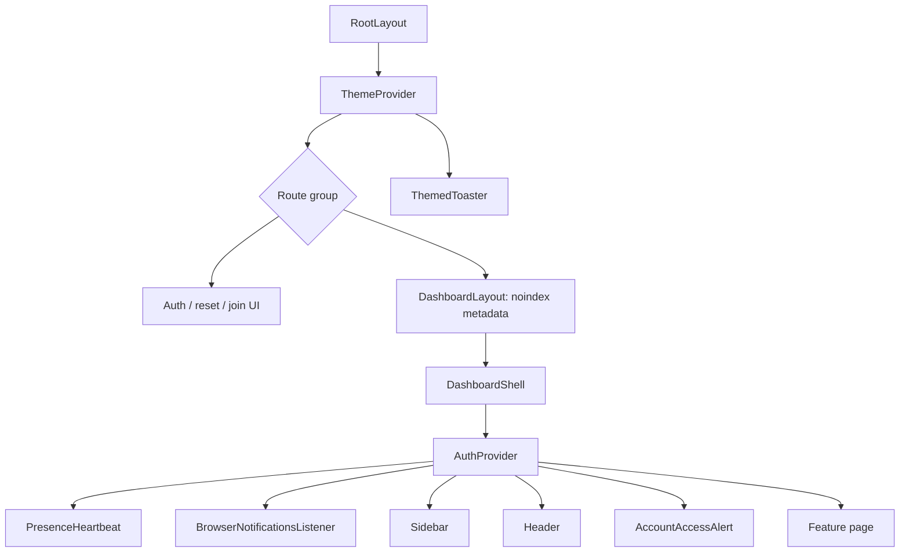
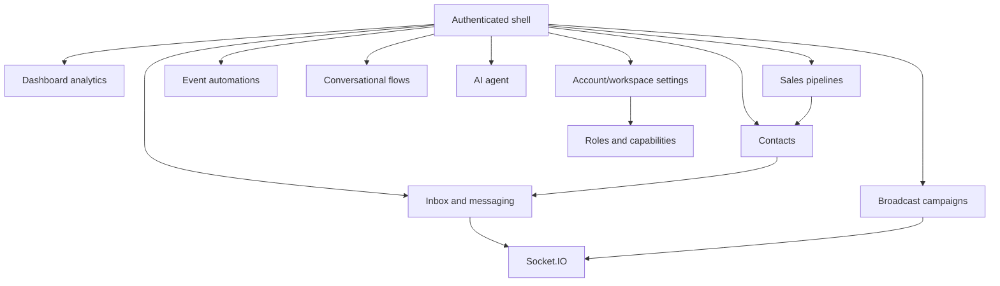

# Frontend architecture

> Scope: `src/app`, `src/components`, and `src/hooks`. This document describes the implementation currently present in the repository; API internals are mentioned only where the UI calls them.

## Related documentation

- [Design system](./design-system.md)
- [UI pages and routes](../modules/pages.md)
- [Component catalog](../modules/components.md)
- [Hooks catalog](../modules/hooks.md)

## Stack and execution model

| Concern | Implementation |
|---|---|
| Framework | Next.js 16 App Router, React 19, TypeScript |
| Runtime/package manager | Bun |
| Styling | Tailwind CSS v4, semantic CSS custom properties, `tailwind-merge` through `cn()` |
| Headless UI | `@base-ui/react`, wrapped by local primitives under `src/components/ui` |
| Icons | `lucide-react` |
| Notifications | Sileo in-app feedback, SweetAlert2 action alerts, and the browser Notification API |
| Charts | Recharts plus the local Tremor-derived chart layer |
| Graph editors | `@xyflow/react` for flows; tree-oriented local builder for automations |
| Drag and drop | `@dnd-kit` for pipeline interactions |
| Authentication | Better Auth client (`src/lib/auth/client`) |
| Realtime | Socket.IO client singleton (`src/lib/realtime/client`) |

Most feature pages and feature components are client components. Server components are retained where Next.js metadata is required: the root layout, dashboard layout, auth layout, join layout, and `/` redirect. Data is generally loaded through account-scoped `/api/*` endpoints from effects or event handlers rather than through a client query library.

## Application shell and provider tree

### Root layer

`src/app/layout.tsx`:

- Loads Inter through `next/font/google` and exposes it as `--font-sans`.
- Imports the Tailwind/token sheet from `src/app/globals.css`.
- Applies `lang="es"`, global no-index metadata, viewport color scheme, and the generated `/icon`.
- Runs a dependency-free `beforeInteractive` script before hydration. It restores the saved accent and light/dark mode to `data-theme` and `data-mode`, preventing a flash of the defaults.
- Mounts `ThemeProvider` and one global `ThemedToaster`.

### Authenticated shell

`src/app/(dashboard)/layout.tsx` stays server-side so it can export no-index metadata. It delegates rendering to `dashboard-shell.tsx`, which:

1. mounts `AuthProvider`;
2. waits for Better Auth session resolution;
3. renders nothing if there is no authenticated user (route protection is expected to redirect outside this client shell);
4. mounts account-wide presence and browser-notification listeners;
5. keeps sidebar/header/content geometry visible through a Boneyard shell skeleton while session and account profile hydration resolve;
6. renders a responsive sidebar, fixed-height header, account-access warning, and scrollable page area.

The sidebar owns the canonical visible navigation list and unread indicators. On small screens it is a controlled drawer with a backdrop, Escape handling, and body-scroll locking; at `lg` it becomes a persistent 240px column.

### Public route shells

- `(auth)/layout.tsx` adds no-index metadata. Login, signup and recovery pages render through the shared `AuthPageShell`, which owns the graphite full-page backdrop, single FuryLeeds mark, bordered panel and optional login/signup navigation.
- `join/layout.tsx` is intentionally separate because an invitation must be visible to both anonymous and authenticated visitors. It centers the card, blocks indexing, and sets `referrer: no-referrer` to avoid leaking the path token.
- `/forgot-password` owns the complete OTP recovery state machine inside the same `AuthPageShell`. `/join/[token]` uses that visual contract through its dedicated security-sensitive layout.

## Routing model

Route groups do not affect URLs:

- `(auth)` contains `/login`, `/signup`, and `/forgot-password`.
- `(dashboard)` contains the authenticated product surface.
- `/join/[token]` is hybrid public/authenticated invitation redemption.
- `/forgot-password` requests and consumes password-reset OTP codes without placing recovery secrets in the URL.
- `/` performs a server redirect to `/dashboard`.

Dynamic product routes use client parameters (`useParams` or React `use(params)`) and fetch their own records. Query parameters are part of the UI contract in several places:

- `/login?invite=…` and `/signup?invite=…` preserve invitation funnels.
- `/login?verified=true` displays email-verification success.
- `/automations/new?template=…` seeds the builder from a known template.
- `/inbox?c=…` deep-links and selects a conversation.
- `/settings?tab=…` is the single source of truth for the active settings section.

See [pages.md](../modules/pages.md) for the complete route-by-route behavior.

## Authentication, accounts, and authorization

### Session and account hydration

`AuthProvider` combines two sources:

- `authClient.useSession()` supplies the Better Auth user/session.
- `GET /api/account` supplies the CRM profile, account, account role, default currency, system role, and superadmin flag.

It exposes loading/error/unlinked account states, profile refresh, sign-out, account metadata, role booleans, and derived capabilities. A failed or unlinked account is surfaced globally by `AccountAccessAlert` so write failures have an actionable explanation. Unauthenticated protected-page requests redirect to the clean canonical `/login` URL; no unused `next` query parameter is retained.

### Role policy

The account hierarchy is `viewer < agent < admin < owner`. `src/lib/auth/roles.ts` is the policy source used by both the UI and API guards:

| Capability | Minimum role | Typical UI use |
|---|---:|---|
| View product data | `viewer` | All dashboard routes |
| `send-messages` / operational writes | `agent` | messages, contacts, deals, broadcasts, automations, flows |
| `edit-settings` | `admin` | workspace configuration, tags/fields, pipelines |
| `manage-members` | `admin` | invitations, role changes, removal |
| `delete-account` | `owner` | irreversible account action |
| `transfer-ownership` | `owner` | ownership transfer |

The UI uses three related patterns:

- `useCan(action)` returns a boolean and returns false while profile data is loading.
- `<RequireRole min="…">` conditionally renders privileged sections.
- `<GatedButton canAct={…}>` preserves the control affordance while disabling an unauthorized action and providing a reason.

These are UX gates, not a security boundary; called API routes must enforce the same policy server-side.

## State and data flow

### Local feature state

There is no global feature-state library. Pages and components use `useState`, `useReducer`-style context where needed, refs, and memoized callbacks. This keeps state close to the UI:

- list pages own filters, pagination, dialogs, pending operations, and loaded records;
- multi-step broadcast creation owns wizard state at the page level;
- the automation builder owns its tree and remote resources;
- the flow editor centralizes graph state in `FlowEditorProvider` so header, canvas, builder, and validation panel share one transaction state;
- settings uses the URL as active-section state.

### Remote data

Feature UIs call same-origin `/api/*` routes with `fetch`. Patterns used consistently include:

- `cache: 'no-store'` for account data and mutable lists;
- independent loading/error/empty states;
- cancellation flags or `AbortController` in long-lived effects;
- optimistic updates with rollback for automation activation;
- explicit mutation refreshes instead of a normalized client cache;
- toasts for mutation results.

The dashboard is a small exception: `src/lib/dashboard/queries` hides endpoint calls and its page starts each widget request in parallel. Each widget keeps an independent loading state, and conversation series are cached per 7/30/90-day range.

### Realtime

A shared Socket.IO client drives:

- conversation changes, hydrated through `GET /api/inbox?conversation_id=…` by `useRealtime`;
- broadcast detail/list refreshes after `broadcast:changed`;
- notification list and unread-summary updates;
- member presence snapshots plus `presence:changed` events;
- browser desktop notifications from `browser-message:created`.

`useTotalUnread` and `useUnreadNotifications` read an external summary store with `useSyncExternalStore`; this avoids each navigation element creating its own network subscription. Consumers must unsubscribe socket listeners in effect cleanup and scope refreshes by entity/account identifiers.

## Major UI domains

- **Inbox:** conversation list, deep-linked active thread, message sending/media/reactions/replies/templates, AI controls, contact sidebar, realtime hydration.
- **Contacts:** searchable paginated list, tags, import, custom fields, contact detail and message/template actions.
- **Pipelines:** selectable pipelines, DnD board, deal forms, analytics, stage/settings management.
- **Broadcasts:** four-step campaign wizard, recipient creation/sending, live campaign metrics, filtering/export, resume/retry.
- **Automations:** event-triggered tree builder with branches, templates, activation and execution logs.
- **Flows:** node/edge conversational editor with validation, activation, auto-layout, and run timelines.
- **AI:** provider/configuration, knowledge documents, playground, auto-reply controls, and admin-only usage reporting.
- **Settings:** URL-addressable personal and workspace panels.

## Media and uploads

Outbound media is uploaded through `src/lib/storage/upload-media`; messaging components retain draft/progress state and then send a resulting URL. Inbound protected WhatsApp image URLs use `useMediaBlobUrl`, which delegates to the credentialed/deduplicated blob cache and revokes object URLs on cleanup. Video and audio intentionally keep direct/proxied URLs so the browser can stream instead of buffering whole files. `MediaLightbox` builds gallery navigation from message media and uses download helpers for explicit saves.

## Error, loading, and empty-state conventions

- Page-level initial fetches render centered spinners or local skeletons.
- Dashboard widgets fail independently and log errors rather than blanking the entire page.
- Mutations use the `src/lib/notifications.ts` Sileo adapter for top-center success/error/warning/info feedback; forms keep inline errors when the user must correct a specific field.
- `src/lib/action-alerts.ts` lazy-loads SweetAlert2 only for confirmations, irreversible/external side effects, sign-out/session revocation, and one-time generated secret reveals. Complex forms remain Base UI dialogs/sheets.
- Dynamic detail pages provide a not-found/error escape back to their collection.
- Destructive actions and externally visible retries/sends use the shared SweetAlert2 confirmation; cancel receives initial focus for destructive operations.
- Lists generally provide dashed-border empty states with a next action.

## Extension guidelines

### Add a page

1. Add `page.tsx` under the appropriate route group.
2. If authenticated, rely on the dashboard shell for global session UI, but enforce permissions in every backing API route.
3. Add sidebar and header title entries if it is a primary destination.
4. Use semantic tokens and existing primitives rather than hard-coded surfaces.
5. Provide loading, error, empty, unauthorized/read-only, and mobile states.
6. If reading query parameters in a client page, retain a `Suspense` boundary to avoid Next.js CSR-bailout build failures.
7. Update [pages.md](../modules/pages.md).

### Add a capability-gated feature

1. Add or reuse a predicate in `src/lib/auth/roles.ts`.
2. Add the typed action to `useCan` if a boolean gate is needed.
3. Gate rendering/actions with `RequireRole`, `useCan`, or `GatedButton`.
4. Mirror the check server-side; never trust the client gate.

### Add realtime behavior

Use the shared socket singleton, filter events to the current entity, hydrate partial events through an account-scoped endpoint when needed, de-duplicate concurrent refreshes, and always remove exactly the registered listener in cleanup.

### Add a theme or primitive

Follow the procedures in [design-system.md](./design-system.md), then document exported UI elements in [components.md](../modules/components.md).
